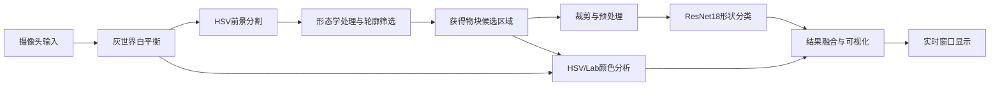

# 基于计算机视觉与深度学习的物块识别系统

## 1. 项目概述

本项目是一个基于电脑摄像头的实时物块识别系统。系统从摄像头获取画面，检测画面中的彩色物块，同时识别物块的形状和颜色，并在图像上绘制检测框、类别名称和置信度。

项目目前支持六种物块形状：球、三棱柱、圆柱、圆锥、长方体和正方体；颜色识别支持红色、橙色、黄色、绿色、青色、蓝色、紫色、黑色、白色和灰色。

系统的总体处理流程如下：



## 2. 实现方式

### 2.1 物块检测

摄像头采集的图像由 OpenCV 以 BGR 格式返回。系统先使用灰世界白平衡方法修正光源造成的颜色偏差，然后将图像转换为 HSV 空间。

物块检测主要依据以下条件生成二值前景掩膜：

- 饱和度达到一定阈值，排除低饱和度背景；
- 亮度达到一定阈值，排除过暗区域；
- 根据色相范围排除木质背景，同时对黄色物块进行特殊保留；
- 使用开运算去除小噪声，使用闭运算填补物块区域中的小孔洞；
- 查找外部轮廓，并按照轮廓面积和是否接触图像边缘进行筛选。

系统会保留所有满足条件的候选轮廓，并按照面积从大到小处理，因此实时识别不仅限于单个物块。

### 2.2 形状识别

形状识别使用基于 ResNet18 的卷积神经网络。项目使用 ImageNet 预训练权重，并采用迁移学习方式进行训练：

1. 冻结 ResNet18 的大部分参数；
2. 解冻最后一层卷积模块 `layer4`，使模型能够适应物块图像特征；
3. 将原始分类层替换为 Dropout 加全连接层；
4. 将输出类别数设置为六类物块；
5. 训练时对图像进行随机水平翻转、随机旋转和随机缩放增强。

训练图像会先通过 HSV 掩膜寻找主要物块并进行裁剪，再缩放为 $224 \times 224$ 像素，转换为 RGB，归一化到 $[0,1]$，最后使用 ImageNet 的均值和标准差进行标准化。

实时推理时，系统根据检测轮廓得到物块外接矩形，并增加一定边距后裁剪原图。模型输出六个类别的 logits，通过 Softmax 转换为概率，取最大概率对应的类别作为形状识别结果，同时显示其置信度。

### 2.3 颜色识别

颜色分析同时使用 HSV 和 Lab 两种颜色空间的思想：

- HSV 适合根据色相、饱和度和亮度进行直观的颜色分类；
- Lab 颜色空间更接近人眼感知，可以通过与参考颜色的距离进行颜色匹配；
- 项目中的 `REF_LAB` 保存了各参考颜色的 Lab 值；
- 点击图像时，系统会输出该像素的 Lab 值、匹配颜色以及 Delta E 距离。

但是，在实际测试中，由于使用的摄像头存在一些偏色，导致Lab识别效果并不符合预期，所以相关功能实现并未使用Lab，而是使用传统的HSV。

在实时识别中，系统在物块轮廓内部进行腐蚀，尽量避开物块边缘和背景混合区域，然后随机抽取最多 40 个内部像素进行投票。每个采样点根据 HSV 规则得到颜色类别，票数最多的颜色作为最终结果，并计算各颜色的投票比例作为颜色概率。

### 2.4 数据集与训练

数据集位于 `CNN_Trans` 目录下，按照类别分别存放图像。目前包含 894 张图像：

| 类别 | 图像数量 |
|---|---:|
| 球 | 42 |
| 三棱柱 | 150 |
| 圆柱 | 221 |
| 圆锥 | 54 |
| 长方体 | 195 |
| 正方体 | 232 |
| 合计 | 894 |

每个类别的数据按照约 70%/15%/15% 划分为训练集、验证集和测试集。训练过程中使用固定随机种子，便于复现实验；使用带类别权重的交叉熵损失，缓解不同类别样本数量不均衡造成的影响；每一轮训练后在验证集上评估，并保存验证准确率最高的模型状态，最终在测试集上评估。

模型保存在 `shape_cnn.pt` 中，文件除网络权重外还保存类别名称和模型版本号。加载模型时，如果文件不存在，或者类别与版本号不匹配，系统会自动重新训练。

## 3. 实现原理

### 3.1 HSV 阈值分割原理

HSV 将颜色分为色相 H、饱和度 S 和明度 V。相对于直接在 BGR 三个通道上设置阈值，HSV 更容易表达“颜色鲜艳且明亮的物块”这一条件。系统通过逻辑运算组合多个阈值，得到前景掩膜，再利用形态学操作改善掩膜质量。

轮廓提取使用 OpenCV 的 `findContours`。对轮廓面积设置上下限，可以去除噪声点和占满画面的错误区域；排除接触边界的轮廓，可以减少物块只显示一部分时造成的误识别。

### 3.2 卷积神经网络分类原理

卷积神经网络通过卷积层逐层提取边缘、纹理、局部结构和整体形状等特征。ResNet18 使用残差连接缓解深层网络训练中的梯度传播问题。由于物块数据量相对有限，直接从零训练完整网络容易过拟合，因此使用预训练模型提取通用视觉特征，只微调后部特征层和新的分类层。

对于输入图像 $x$，模型输出六个类别的分数 $z_i$，Softmax 概率为：

$$
p_i = \frac{e^{z_i}}{\sum_{j=1}^{6} e^{z_j}}
$$

系统选择概率最大的类别作为预测结果。训练时使用加权交叉熵，使样本较少的类别在损失函数中具有相对更高的影响。

### 3.3 颜色投票原理

单个像素容易受到反光、阴影和噪声影响，因此系统不依赖一个像素判断颜色，而是在轮廓内部抽取多个像素。每个采样点独立分类，再通过多数投票得到物块颜色。这样可以降低局部异常像素对结果的影响。

系统还提供 Lab 像素查询功能。OpenCV 的 8 位 Lab 图像中，L 通道需要从 0 到 255 映射到 0 到 100，a 和 b 通道需要减去 128 才能得到以零为中心的近似值。颜色匹配时使用欧氏距离作为 CIE76 Delta E 的基础形式：

$$
\Delta E_{ab}^{*} = \sqrt{(L_1^*-L_2^*)^2 + (a_1^*-a_2^*)^2 + (b_1^*-b_2^*)^2}
$$

## 4. 设计架构

项目采用按职责拆分的模块化结构：

| 文件或目录 | 主要职责 |
|---|---|
| `main.py` | 系统入口、摄像头循环、物块检测、结果显示和用户交互 |
| `shape_cnn.py` | CNN 网络定义、数据集读取、预处理、训练、模型加载和形状推理 |
| `train_shape_model.py` | 独立启动形状模型训练 |
| `color_analysis.py` | 白平衡、HSV 颜色判断、Lab 距离匹配、采样投票和像素查询 |
| `color_value.py` | 各参考颜色的 Lab 数值 |
| `collect_camera_data.py` | 通过摄像头自动或手动框选采集训练图片 |
| `CNN_Trans/` | 按六种形状分类保存的训练图像 |
| `shape_cnn.pt` | 已训练的形状分类模型权重和版本信息 |

系统分为三层：

1. **输入与采集层**：负责摄像头读取和训练图片采集；
2. **视觉处理与推理层**：负责白平衡、前景分割、轮廓提取、颜色分析和 CNN 推理；
3. **交互展示层**：负责绘制检测框、中文识别结果、采样点、鼠标点击标记和退出控制。

这种结构使训练流程和实时推理流程相互独立。修改颜色算法时主要影响 `color_analysis.py`，修改网络或预处理时主要影响 `shape_cnn.py`，主程序只负责组织调用和展示结果。

## 5. 使用方法

### 5.1 安装依赖

项目主要依赖以下 Python 包：

- Python
- OpenCV：摄像头访问、图像处理、轮廓提取和窗口显示
- NumPy：数组运算和图像数据处理
- Pillow：绘制中文文字
- PyTorch：神经网络训练和推理
- Torchvision：提供 ResNet18 及其预训练权重

### 5.2 训练模型

确认 `CNN_Trans` 下六个类别目录中存在训练图片后，运行：

```powershell
python train_shape_model.py
```

训练完成后会生成或更新 `shape_cnn.pt`。

### 5.3 启动实时识别

```powershell
python main.py
```

启动后将摄像头对准物块，系统会显示形状、形状置信度、颜色和颜色投票概率。按 `Q` 或 `Esc` 退出。鼠标点击图像后，可以在终端查看点击像素的 Lab 值和参考颜色匹配结果。

### 5.4 采集训练数据

```powershell
python collect_camera_data.py
```

采集程序支持以下操作：

- 按 `1` 到 `6` 为当前检测到的物块标注六种形状并保存图片；
- 按 `R` 手动框选物块；
- 按 `C` 清除手动框，恢复自动检测；
- 按 `Q` 或 `Esc` 退出采集。

## 6. 设计体会

### 6.1 传统视觉与深度学习结合更合适

物块位置检测和形状分类解决的是不同问题。HSV 阈值和轮廓方法计算量低、解释性强，适合快速找到前景区域；CNN 更擅长从图像中学习球体、棱柱和旋转角度等复杂形状特征。因此项目没有让 CNN 直接处理整幅摄像头画面，而是先用传统视觉缩小识别范围，再交给 CNN 分类。

### 6.2 颜色识别需要考虑真实拍摄环境

摄像头的自动曝光、光源颜色、反光和阴影都会改变像素值。增加灰世界白平衡、轮廓内部采样和多数投票后，颜色判断不再完全依赖某一个位置的像素。但阈值仍然和背景、灯光及摄像头有关，换用不同场景时需要重新调整。

### 6.3 数据质量比单纯增加训练轮数更重要

六类图像数量差异较大，代码通过数据增强、类别加权和验证集选优进行补偿。实际效果还取决于训练图片是否覆盖不同角度、距离、光照和摆放方式。采集数据时应尽量保持类别标签准确，并加入与实际使用场景相似的样本。

### 6.4 工程鲁棒性需要和识别精度同时考虑

项目对摄像头打不开、读取失败、图片无法解码、模型文件不存在等情况进行了处理；模型还保存版本号，避免预处理或类别发生变化后继续加载不兼容的权重。中文字体也设置了多个候选路径，并提供 OpenCV 字体回退方案。

## 7. 所学知识

通过本项目可以掌握以下内容：

1. 使用 OpenCV 读取摄像头、颜色空间转换、阈值分割、形态学处理和轮廓分析；
2. 理解 BGR、RGB、HSV 和 Lab 之间的转换及其适用场景；
3. 使用 PyTorch 定义模型、数据集、数据加载器、损失函数、优化器和推理流程；
4. 理解迁移学习、冻结层、微调、数据增强和预训练权重的作用；
5. 了解训练集、验证集和测试集的划分方式及验证集选优；
6. 认识类别不均衡问题，并使用加权交叉熵进行改善；
7. 学习如何把图像采集、模型训练、模型加载和实时推理组织成完整应用；
8. 学习通过版本信息、异常处理和模块拆分提高程序的可维护性。

## 8. 所用工具

| 工具或库 | 用途 |
|---|---|
| Visual Studio Code | 编写、调试和管理项目代码 |
| Python | 项目主要开发语言 |
| OpenCV | 摄像头采集、图像预处理、分割、轮廓和窗口交互 |
| NumPy | 数值计算、掩膜处理和颜色数据运算 |
| Pillow | 绘制中文识别结果 |
| PyTorch | 构建、训练和部署 CNN 模型 |
| Torchvision | 提供 ResNet18 和 ImageNet 预训练权重 |
| PowerShell | 运行训练、采集和识别命令 |
| Mermaid | 绘制项目流程图 |

## 9. 项目局限与改进方向

当前系统的前景分割依赖 HSV 阈值和木质背景假设，在背景颜色、光照或物块颜色变化较大时可能出现漏检或误检。颜色识别主要基于 HSV 规则投票，形状识别也只覆盖预先定义的六类。

后续可以从以下方向改进：

- 增加不同背景、光照、距离和角度下的训练样本；
- 使用更稳定的目标检测或实例分割模型处理复杂背景和多个相邻物块；
- 对颜色识别增加光照自适应或基于标定板的颜色校准；
- 增加混淆矩阵、分类报告和每类准确率等评估指标；
- 使用 GPU 或轻量化网络提升实时帧率；
- 将识别结果保存为日志或导出为结构化数据，便于后续统计分析。

## 10. AI使用情况
### 使用AI：Github Copilot Student（包含 GPT5.6 Sol 、 GPT-5.6 Luna 和 MAI-Code-1.1-Flash ）
### 提问问题
1. 1.现在它只会识别图片中的阴影，形状的话只会输出球、圆柱，形状识别非常不准确 2.一帧视频流中会出现多个物块，做好多物块的处理
2. 这个文件夹里是物块照片。但是没有具体分训练集、验证集和测试集。而且文件也没有命名，但是每一个文件夹里都是同一类的物块。物块颜色比较单一，记得做灰度。你自己分好训练集。照片我已经裁剪过了，但是大小不统一，记得先统一大小。CNN的相关代码记得自己写，训练用CPU
3. 现在效果不太好，我想做一个增强学习。因为现在数据集内的图片是用手机拍的，但是识别的时候用的是电脑的摄像头，你接下来就调用电脑摄像头来拍摄。我来选是什么物体，同时这部分图片先进训练集，我们做一下训练，如果效果依旧不好，就要进行模型微调了。你先用OpenCV识别物块的大小，并框选好，我来选择物体形状，选好之后直接进训练集
4. 用CNN实现物体形状识别
5. 不再使用自训练模型，你用预训练模型吧
6. 分析一下这个项目完成项目介绍.md，要求内容包括：实现方式、实现原理、设计架构、设计体会、所学知识、所用到的工具